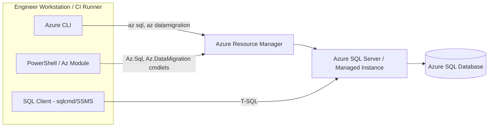

# System Design

## Overview

This repository is a collection of standalone Azure CLI, PowerShell, and T-SQL scripts used to
provision, migrate, secure, and monitor Azure SQL Database / SQL Server environments. There is no
application runtime — each script is executed manually (or from a CI/CD pipeline) against Azure or
a SQL Server/Azure SQL instance.

## Libraries & Dependencies

| Dependency | Used By | Purpose |
|---|---|---|
| [Azure CLI](https://learn.microsoft.com/cli/azure/) (`az`) | `DataMigrationService.sh`, `deployazuredb.sh` | Provision resource groups, SQL servers/databases, firewall rules, and run Azure Database Migration Service (DMS) operations |
| Azure CLI extension `datamigration` | `DataMigrationService.sh` | Adds the `az datamigration` command group (installed via `az extension add --name datamigration`) |
| [Az PowerShell module](https://learn.microsoft.com/powershell/azure/) (`Az.Accounts`, `Az.Resources`, `Az.Sql`, `Az.DataMigration`) | `deployazuredb.ps1`, `armtemplatedeployment.ps1`, `DataMigrationService.ps1` | Cmdlet equivalents of the CLI operations (`New-AzResourceGroup`, `New-AzSqlServer`, `New-AzSqlDatabase`, `New-AzResourceGroupDeployment`, `New-AzDataMigrationToSqlDb`) |
| ARM Quickstart Template (`sql-logical-server/azuredeploy.json`) | `armtemplatedeployment.ps1` | Declarative ARM template deployed via `New-AzResourceGroupDeployment` to create a SQL logical server |
| T-SQL / Transact-SQL | All `.sql` files | Server-side scripts for backup/restore, partitioning, security, replication, and monitoring, run against SQL Server or Azure SQL |
| OpenSSL (`openssl rand`) | `deployazuredb.sh` | Generates a random admin password on Bash/Linux |
| SQL Server Replication engine (`sp_add*` system stored procedures) | `TransRepQueries/*.sql` | Configures transactional replication (distributor, publisher, articles, subscriptions) |
| SQL Server Extended Events (`sys.dm_xe_*`, `CREATE EVENT SESSION`) | `PerformanceMonitoring/xevents.sql` | Low-overhead tracing/diagnostics |
| Workload Group Classifier function | `PerformanceMonitoring/classifierfunction.sql` | Routes sessions to Resource Governor workload groups based on login name |
| Row-Level Security / Security Policies | `DatabaseAuthentication-Security/rowlevelsecurity.sql` | Restricts row visibility per tenant using a security predicate function |
| Transparent Data Encryption (TDE) | `DatabaseAuthentication-Security/TDEkeys.sql` | Encrypts data at rest using a master key + certificate + database encryption key |
| Data Classification / Microsoft Purview | `DatabaseAuthentication-Security/sensitivity-classification.sql`, `purview.sql` | Tags sensitive columns and grants Purview scanning access |

## Data Structures

The repository does not implement application-level data structures (arrays, trees, etc.). Instead,
the relevant "data structures" are SQL Server/Azure SQL storage and metadata constructs:

- **Relational tables** — e.g. `Sales`, `Order`, `Orders` — plain row-store tables referenced by the
  demo queries.
- **Partition function/scheme** (`partition.sql`) — a range-partitioned table structure. The
  `PartitionByMonth` function buckets rows by `datetime2` boundary values, and `PartitionByMonthSch`
  maps each partition to a distinct filegroup, giving each month of `Order` data physical isolation.
- **Roles & principals** (`CreateUser.sql`) — SQL logins/users organized into database roles
  (e.g. `SalesReader`) for permission grouping (RBAC).
- **Security predicate function + Security Policy** (`rowlevelsecurity.sql`) — an inline table-valued
  function (`sec.tvf_SecurityPredicatebyTenant`) used as a filter predicate, structurally similar to
  a row-level access-control list keyed by `TenantName`.
- **Extended Events session objects** (`xevents.sql`) — event/action/target metadata rows queried
  from the `sys.dm_xe_*` catalog views.
- **Replication topology objects** (`TransRepQueries/*.sql`) — distributor, publisher, publication,
  article, and subscription records used by the SQL Server replication engine.

## Algorithms

Most scripts are declarative/administrative (CLI or DDL statements) rather than algorithmic. The
notable procedural/algorithmic logic is:

- **Workload classification (`classifierfunction.sql`)** — a simple deterministic branching
  algorithm (`IF / ELSE IF / ELSE`) that maps `SUSER_NAME()` to a workload group name, used by
  Resource Governor to route and prioritize sessions.
- **Range partition assignment (`partition.sql`)** — SQL Server's internal range-partitioning
  algorithm (`RANGE RIGHT`) determines which filegroup/partition a row belongs to by comparing
  `OrderDate` against the ascending boundary list via binary search over the boundary values.
  This is standard SQL Server engine behavior, not custom code.
- **Row-level security predicate evaluation** — SQL Server transparently applies the
  `sec.tvf_SecurityPredicatebyTenant` filter predicate as an implicit `WHERE` clause on every query
  against `Sales`, evaluated per-row against the executing user's identity.
- **Dynamic SQL construction (`dynamicsqlexecprocedurs.sql`, `sqlinjectionexample.sql`)** —
  string-concatenation/`sp_executesql` patterns. `sqlinjectionexample.sql` is an intentional
  **anti-pattern** included to illustrate SQL injection risk (unparameterized dynamic SQL and
  hex-encoded command execution) — it is for educational reference only and must not be run
  against production data.

## Security Notes

- Several scripts contain placeholder credentials/passwords in plain text
  (e.g. `ChangeYourAdminPassword1`, `'YourPassword'`). These are examples only — real deployments
  must supply secrets via a secure mechanism (Azure Key Vault, secure prompts, pipeline secrets),
  never hard-coded.
- `sqlinjectionexample.sql` intentionally demonstrates SQL injection and dynamic command execution
  vulnerabilities for training purposes. Do not execute it against a real/production database.
